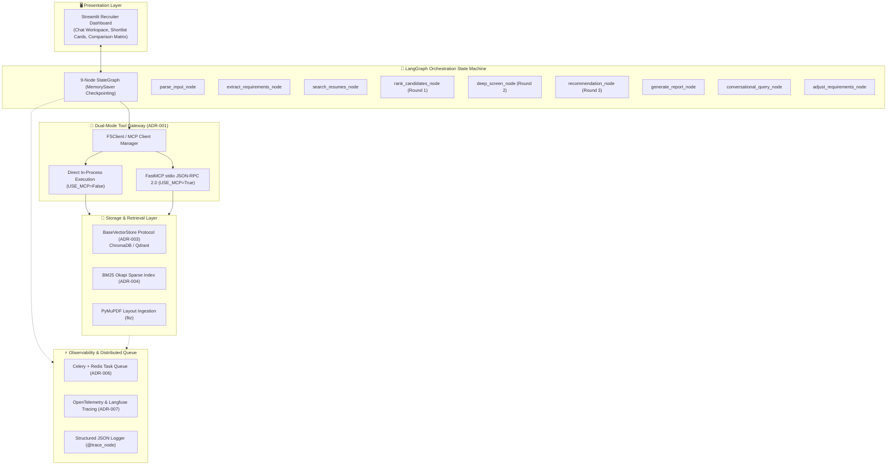
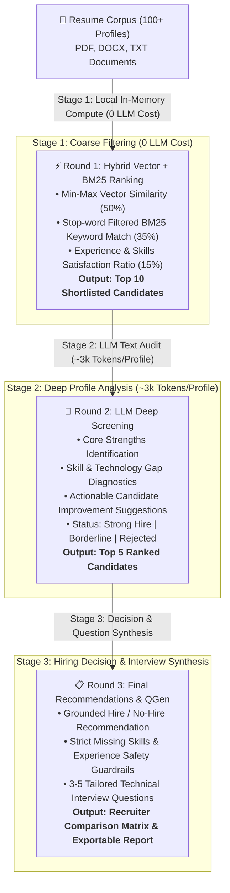

# Agentic Profile Matching Engine

<p align="left">
  <a href="https://github.com/shashankch/agentic-profile-matching-engine/actions/workflows/ci.yml"></a>
  <a href="LICENSE"></a>
  <a href="https://www.python.org/"></a>
  <a href="https://github.com/astral-sh/ruff"></a>
  <a href="docs/CONVENTIONS.md"></a>
  <a href="CONTRIBUTING.md"></a>
</p>

An interactive **AI Recruiter & Profile Matching Engine** built with **LangGraph**, **Hybrid RAG (Semantic Vector + BM25 Okapi)**, and the **Model Context Protocol (MCP)**. 

The engine automates multi-stage candidate vetting by parsing unstructured job descriptions, executing a cost-efficient **3-Round Cascading Screening Funnel**, producing grounded hiring recommendations with tailored technical interview questions, and enabling real-time conversational requirement adjustments mid-session.

---

## 🏛️ System Architecture



---

## 🎯 3-Stage Cascading Screening Funnel

To eliminate rate-limit bottlenecks and optimize LLM token consumption ($O(N) \to O(K)$), candidate evaluation cascades across 3 tiers:



---

## 🏆 Engineering Highlights & Architecture Decisions

The system architecture is governed by **8 formal Architecture Decision Records (ADRs)** documented in [`docs/ARCHITECTURE_DECISIONS.md`](docs/ARCHITECTURE_DECISIONS.md):

| ADR | Title | Key Architectural Choice | Production Impact |
|:---|:---|:---|:---|
| **[ADR-001](docs/ARCHITECTURE_DECISIONS.md#adr-001-model-context-protocol-mcp-dual-mode-gateway-architecture)** | **MCP Dual-Mode Gateway** | Dynamic toggle between in-process Python and FastMCP JSON-RPC 2.0 `stdio` transport | Zero-overhead local testing + full microservice protocol compliance |
| **[ADR-002](docs/ARCHITECTURE_DECISIONS.md#adr-002-using-typeddict-for-agentstate-over-pydantic-basemodel)** | **TypedDict State Management** | `TypedDict` for graph state with strict Pydantic V2 models at LLM I/O boundaries | Eliminates checkpointer serialization overhead while guaranteeing type safety |
| **[ADR-003](docs/ARCHITECTURE_DECISIONS.md#adr-003-basevectorstore-structural-protocol-over-abstract-base-class-abcabc)** | **BaseVectorStore Protocol** | Structural typing (`typing.Protocol`) instead of rigid class inheritance | Swappable vector backends (ChromaDB, Qdrant) via dependency injection |
| **[ADR-004](docs/ARCHITECTURE_DECISIONS.md#adr-004-bm25-okapi-corpus-index-caching-with-invalidation)** | **BM25 Index Caching** | Memory-cached `BM25Okapi` sparse matrix with MD5 corpus fingerprint checks | Reduces hybrid search query latency from ~200ms down to **~0.1ms** |
| **[ADR-005](docs/ARCHITECTURE_DECISIONS.md#adr-005-idempotent-upsert-ingestion-with-section-scoped-chunk-keys)** | **Idempotent Ingestion** | Section-scoped deterministic chunk keys (`{file}_chunk_{idx}`) | 100% idempotent document re-ingestion without database bloat |
| **[ADR-006](docs/ARCHITECTURE_DECISIONS.md#adr-006-celery--redis-task-queue-for-asynchronous-heavy-operations)** | **Celery + Redis Task Queue** | Distributed task worker queue with Docker Compose orchestration | Non-blocking background PDF ingestion and parallel LLM candidate audits |
| **[ADR-007](docs/ARCHITECTURE_DECISIONS.md#adr-007-structured-json-logging--pluggable-tracing-pipeline)** | **Production Observability** | Structured JSON logging + `@trace_node` decorator with Langfuse & OTel support | Millisecond node latency tracking and enterprise APM log compatibility |
| **[ADR-008](docs/ARCHITECTURE_DECISIONS.md#adr-008-multi-factor-hybrid-candidate-scoring--grounded-llm-recommendation-hierarchy)** | **Multi-Factor Scoring & Hierarchy** | Min-max vector scaling + grounded LLM status hierarchy with safety guardrails | Eliminates arbitrary score cutoffs and prevents prompt hallucinations |

---

## 🧩 Supported Capabilities & Tech Stack

| Category | Supported Technologies & Standards | Configuration / Usage |
|:---|:---|:---|
| **Agent Framework** | [LangGraph] (StateGraph, MemorySaver, Conditional Routing, Dynamic Subgraphs) | `agent/` modular package |
| **Vector Storage** | [ChromaDB] (Default Persistent Store), [Qdrant] (Enterprise Vector Store Stub) | `BaseVectorStore` protocol injection |
| **Sparse Retrieval** | [Rank-BM25] (BM25Okapi with stop-word tokenization and cache invalidation) | `job_matcher.py` |
| **LLM Providers** | [Groq API] (Llama 3.3 70B, Qwen 2.5), [Google Gemini Pro], Local Ollama | `.env` credentials |
| **Document Ingestion** | **PyMuPDF** (`fitz` multi-column layout sorting), **Unstructured.io**, `python-docx`, `pypdf` | `IngestionService` + `fs_tools.py` |
| **Protocol Standards** | [Model Context Protocol (MCP)][mcp] (FastMCP `stdio` JSON-RPC 2.0 servers) | `USE_MCP=True/False` |
| **Observability** | Structured JSON Logs, [Langfuse], [OpenTelemetry] (OTLP), `@trace_node` | `OBSERVABILITY_BACKEND` |
| **Background Workers** | [Celery] distributed task queue + [Redis 7] broker & state backend | `docker-compose.yml` |

---

## ⚡ 60-Second Quickstart

### 1. Clone & Setup Environment

```bash
# Clone the repository
git clone https://github.com/shashankch/agentic-profile-matching-engine.git
cd agentic-profile-matching-engine

# Create and activate virtual environment (Python 3.10+)
python3 -m venv .venv
source .venv/bin/activate

# Install in editable mode with all dependencies
pip install -e .
```

### 2. Configure Credentials

Create a `.env` file in the root directory:

```env
# Free-tier Developer API Keys (Choose one or both)
GROQ_API_KEY="your-groq-api-key"
GEMINI_API_KEY="your-gemini-api-key"

# MCP Protocol Mode (False: Direct local execution | True: stdio JSON-RPC servers)
USE_MCP=False

# Observability Backend (none | langfuse | opentelemetry)
OBSERVABILITY_BACKEND=none
```

### 3. Generate Mock Data & Ingest

```bash
# Generate synthetic multi-format candidate resumes (31 profiles: PDF, DOCX, TXT)
python -m agentic_profile_matching.generate_dataset

# Chunk, embed, and vector-index candidate profiles into ChromaDB (Idempotent)
python -m agentic_profile_matching.resume_rag
```

### 4. Launch Application

```bash
# Launch interactive Streamlit Recruiter Dashboard
streamlit run src/agentic_profile_matching/app.py
```

*Access the dashboard at `http://localhost:8501` to test candidate matching, side-by-side comparisons, and conversational refinement.*

---

## 🐳 Docker Compose Deployment

Launch the complete containerized stack (Streamlit UI, Redis Broker, and Celery Background Worker):

```bash
# Start all microservices in the background
docker compose up -d

# View real-time service logs
docker compose logs -f
```

---

## 🧪 Testing & Automated Quality Gates

```bash
# Run unit and integration test suite (61 tests)
pytest tests/ -v

# Run RAG Evaluation Benchmark Suite (Recall@K, MRR & Faithfulness)
pytest tests/eval/ -m eval -v

# Run Ruff linter and code formatter checks
ruff check src/ tests/
ruff format --check src/ tests/
```

---

## 📚 Technical Documentation & Deep-Dives

- 🏛️ **[Detailed System Architecture & Specifications](docs/architecture.md)**: Deep dive on dataflow sequences, mathematical scoring formulations, state transitions, and distributed scaling.
- 📐 **[Formal Architecture Decision Records (ADRs 001–008)](docs/ARCHITECTURE_DECISIONS.md)**: Design context, evaluated alternatives, trade-offs, and consequences.
- 🗺️ **[Implementation Roadmap](docs/ROADMAP.md)**: Phased milestones, completed deliverables, and future backlog.
- 🛡️ **[Engineering Conventions](docs/CONVENTIONS.md)**: Architectural patterns, Pydantic V2 schemas, error boundaries, and type safety rules.
- 🤝 **[Contributing Guidelines](CONTRIBUTING.md)**: Local developer workflow, PR conventions, and quality gates.
- 📝 **[Changelog](CHANGELOG.md)**: Semantic versioning release history.

---

<!-- References -->
[langgraph]: https://langchain-ai.github.io/langgraph/
[streamlit]: https://streamlit.io/
[ChromaDB]: https://www.trychroma.com/
[Qdrant]: https://qdrant.tech/
[mcp]: https://modelcontextprotocol.io/
[Docker]: https://www.docker.com/
[Sentence Transformers]: https://sbert.net/
[Rank-BM25]: https://github.com/dorianbrown/rank_bm25
[Groq API]: https://groq.com/
[Google Gemini Pro]: https://ai.google.dev/
[Celery]: https://docs.celeryq.dev/
[Redis 7]: https://redis.io/
[Langfuse]: https://langfuse.com/
[OpenTelemetry]: https://opentelemetry.io/