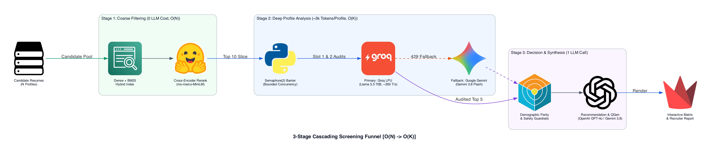

<div align="center">

# 💼 Yojaka AI (Agentic Profile Matching Engine)

<p align="center">
  <a href="https://yojaka-ai-job-profile-matching-engine.streamlit.app/"></a>
  <a href="https://shashankch.github.io/yojaka-ai-profile-matching-engine/"></a>
  <a href="https://github.com/shashankch/yojaka-ai-profile-matching-engine/actions/workflows/deploy-docs.yml"></a>
  <a href="https://github.com/shashankch/yojaka-ai-profile-matching-engine/actions/workflows/ci.yml"></a>
  <a href="CHANGELOG.md"></a>
  <a href="https://www.python.org/"></a>
  <a href="docs/adr/README.md"></a>
  <a href="https://github.com/astral-sh/ruff"></a>
  <a href="LICENSE"></a>
  <a href="docs/CONVENTIONS.md"></a>
  <a href="CONTRIBUTING.md"></a>
</p>

<p align="center">
  Production-Grade AI Recruiter &amp; Profile Matching Engine built with <b>LangGraph</b>, <b>Layout-Aware Section Parsing</b>, <b>Anthropic Contextual Retrieval</b>, <b>Two-Stage Cross-Encoder Reranking</b>, <b>Hybrid RAG</b>, <b>Dynamic Semantic Skill Expansion</b>, <b>Zero-Disk In-Memory Upload</b>, and <b>Model Context Protocol (MCP)</b>.
</p>

</div>

| 💡 **What is Yojaka (योजक)?** |
| :--- |
| <small>In classical Sanskrit, <b>योजक (Yojaka)</b> derives from the root <i>युज् (yuj)</i> — meaning <i>to connect, unite, align, or orchestrate</i>. Rather than treating candidate vetting as a cold keyword gatekeeper, <b>Yojaka AI</b> operates as an intelligent orchestrator: parsing unstructured human potential, dynamically expanding semantic equivalences, and cascading through structured reasoning to match talent with purpose.</small> |

<p align="center">
  
</p>

---

## ⚡ Core Highlights & Capabilities

- 🎯 **3-Stage Cascading Funnel (`O(N) → O(K)`)**: Coarse hybrid vector/lexical retrieval (Stage 1) → structured LLM profile audit (Stage 2) → grounded decision synthesis with tailored interview questions (Stage 3). Eliminates rate-limit bottlenecks and token exhaustion.
- 📑 **Layout-Aware Section Document Parsing**: Parses PDF visual layout blocks (`pymupdf`), DOCX paragraph runs, and text delimiters into canonical sections (`SUMMARY`, `EXPERIENCE`, `SKILLS`, `EDUCATION`), preserving multi-role work histories without mid-sentence truncation.
- 🧠 **Anthropic Contextual Retrieval Prepending**: Situates isolated resume chunks with 50–80 word document metadata banners before dense embedding and BM25 indexing, preserving pristine candidate text for recruiter UI display.
- ⚖️ **Two-Stage Hybrid Retrieval & Cross-Encoder Reranking**: Combines dense vector cosine similarity with BM25 Okapi lexical scoring, followed by fine-grained `cross-encoder/ms-marco-MiniLM-L-6-v2` reranking with Sigmoid score calibration and Reciprocal Rank Fusion (RRF).
- 🔀 **LLM-Driven Intent Routing**: Zero-shot structured intent routing with dynamic exemplar synthesis and an in-memory LRU query routing cache for sub-millisecond repeated queries.
- 🔒 **Zero-Disk In-Memory Upload & Ephemeral PII Isolation**: Ingests `.pdf`, `.docx`, and `.txt` files directly in memory via `io.BytesIO` layered through `CompositeVectorStore` with session-scoped in-memory vector stores ([ADR-016](docs/adr/ADR-016-zero-disk-in-memory-resume-ingestion.md)).
- 🖥️ **Dual Presentation Layer**: Clean `<75-LOC` Streamlit conductor (`app.py`) featuring `st.write_stream` typewriter streaming and live tool execution tracing, coupled with a headless FastAPI sidecar (`api/`) exposing REST and Server-Sent Events (SSE) endpoints.
- 🔌 **Model Context Protocol (MCP) Dual Gateway**: Hot-swap between in-process tool execution and FastMCP JSON-RPC `stdio` servers ([ADR-001](docs/adr/ADR-001-mcp-dual-mode-gateway-architecture.md)).

---

## 🏛️ System Architecture

<p align="center">
  
</p>

> 📚 **Documentation & Deep Dive**: For the full interactive documentation site, visit [**shashankch.github.io/yojaka-ai-profile-matching-engine**](https://shashankch.github.io/yojaka-ai-profile-matching-engine/). For local technical architecture, mathematical scoring formulations, and security specifications, see [**docs/architecture.md**](docs/architecture.md).

---

## 🎯 3-Stage Cascading Screening Funnel

Candidate evaluation cascades across 3 tiers to optimize LLM token consumption `O(N) → O(K)`:

<p align="center">
  
</p>

---

## 🧩 Supported Capabilities & Tech Stack

| Category | Technologies & Standards | Configuration / Usage |
|:---|:---|:---|
| **Agent Framework** | [LangGraph] (StateGraph, MemorySaver, LLM Intent Router) | `agent/` modular package |
| **Presentation UI** | [Streamlit] (Modular Component Architecture, `st.write_stream`) | `ui/` modular package & `app.py` |
| **REST & SSE API** | [FastAPI], [Uvicorn], Server-Sent Events (SSE) Streaming | `api/` package (`routes.py`, `app.py`) |
| **Vector Storage** | [ChromaDB], `InMemoryVectorStore` (Zero-Disk Cloud Fallback), [Qdrant] | `BaseVectorStore` protocol injection |
| **Sparse & Rerank** | [Rank-BM25] (BM25Okapi), [Sentence Transformers] Cross-Encoder (`ms-marco-MiniLM-L-6-v2`) | `services/reranker.py` & `job_matcher.py` |
| **LLM Providers** | [Groq API] (Llama 3.3 70B), [Google Gemini Pro], [Sarvam AI] (`sarvam-105b`), [OpenAI] | `.env` credentials & UI dropdown |
| **Document Ingestion** | **Layout Section Parsing** (`SectionParser`), **Contextual Retrieval** (`ContextualEnricher`), **PyMuPDF**, `python-docx` | `IngestionService` + `services/` |
| **Protocol Standards** | [Model Context Protocol (MCP)][mcp] (FastMCP `stdio` JSON-RPC 2.0) | `USE_MCP=True/False` |
| **Observability** | Structured JSON Logs, [Langfuse], [OpenTelemetry] (OTLP), `@trace_node` | `OBSERVABILITY_BACKEND` |
| **Background Workers** | [Celery] distributed task queue + [Redis 7] broker & state backend | `docker-compose.yml` |

---

## ⚡ 60-Second Quickstart

### 1. Clone & Setup Environment

```bash
# Clone the repository
git clone https://github.com/shashankch/yojaka-ai-profile-matching-engine.git
cd yojaka-ai-profile-matching-engine

# Create and activate virtual environment (Python 3.10+)
python3 -m venv .venv
source .venv/bin/activate

# Install in editable mode with dependencies
pip install -e .
```

### 2. Configure Credentials

```bash
cp .env.example .env
```

| Variable | Required? | Default | Description |
|:---|:---:|:---|:---|
| `GROQ_API_KEY` | Conditional | `""` | Free-tier fast default for Llama 3.3 70B inference. |
| `GEMINI_API_KEY` | Conditional | `""` | Google Gemini 3.8 Pro / Flash. |
| `TAVILY_API_KEY` | Optional | `""` | Real-time external web search for tech trends & company intelligence. |
| `OPENAI_API_KEY` | Optional | `""` | OpenAI GPT-4o / GPT-4o-mini models. |

> 💡 *For the complete configuration reference, see [Architecture Section 14](docs/architecture.md#14-environment-variables--runtime-configuration-reference) and [`.env.example`](.env.example).*

### 3. Generate Mock Data & Ingest

```bash
# Generate synthetic multi-format candidate resumes (34 profiles: PDF, DOCX, TXT)
python -m agentic_profile_matching.generate_dataset

# Chunk, enrich, and vector-index candidate profiles into ChromaDB (Idempotent)
python -m agentic_profile_matching.resume_rag
```

### 4. Launch Application

**Option A: Interactive Streamlit Recruiter Dashboard**
```bash
streamlit run src/agentic_profile_matching/app.py
```
*Access the dashboard at `http://localhost:8501`.*

**Option B: Headless FastAPI Gateway Sidecar**
```bash
python -m agentic_profile_matching.api.main
# Or via uvicorn directly:
uvicorn agentic_profile_matching.api.app:app --host 0.0.0.0 --port 8000
```
*Explore interactive OpenAPI documentation at `http://localhost:8000/docs`.*

---

## 🐳 Docker Deployment

```bash
# Start Streamlit UI, Redis Broker, and Celery Background Worker
docker compose up -d

# View real-time logs
docker compose logs -f
```

---

## 🧪 Testing & Automated Quality Gates

```bash
# Run complete unit and integration test suite (116 tests)
pytest tests/ -v

# Run RAG Evaluation Benchmark Suite (Recall@K, MRR & Faithfulness)
pytest tests/eval/ -m eval -v

# Run Ruff linter and code formatter checks
ruff check src/ tests/
ruff format --check src/ tests/
```

---

## 📚 Technical Documentation & Resources

- 🌐 **[Online Documentation Site (MkDocs Material)](https://shashankch.github.io/yojaka-ai-profile-matching-engine/)**: Interactive documentation hosted on GitHub Pages with instant full-text search, light/dark themes, interactive C4 architecture diagrams, and ADR catalog.
- 🏛️ **[System Architecture & Technical Specifications](docs/architecture.md)**: Deep dive on dataflow sequences, mathematical formulations, state transitions, and distributed scaling.
- 📐 **[Architecture Decision Records (ADRs 001–017)](docs/adr/README.md)**: Complete catalog of formal design decisions, evaluated alternatives, and trade-offs.
- 🗺️ **[Implementation Roadmap](docs/ROADMAP.md)**: Phased milestones (Completed Phases 1–17 and Future Backlog Phases 18–20).
- 🛡️ **[Engineering Conventions](docs/CONVENTIONS.md)**: Architectural patterns, Pydantic V2 schemas, error boundaries, and type safety rules.
- 🤝 **[Contributing Guidelines](CONTRIBUTING.md)**: Local developer setup, branching conventions, and quality gates.
- 📝 **[Changelog](CHANGELOG.md)**: Semantic versioning release history.
- 📄 **[License](LICENSE)**: Apache License 2.0.

---

## ⚖️ License & Trademarks

This project is licensed under the Apache License 2.0 — see the [LICENSE](LICENSE) file for details.

> ℹ️ **Trademarks & Brand Logos Notice**: All product names, logos, brands, trademarks, and registered trademarks are property of their respective owners. All company, product, and service names used in this project and documentation are for identification purposes only. Use of these names, logos, and brands does not imply endorsement.

---

<!-- References -->
[langgraph]: https://langchain-ai.github.io/langgraph/
[streamlit]: https://streamlit.io/
[FastAPI]: https://fastapi.tiangolo.com/
[Uvicorn]: https://www.uvicorn.org/
[ChromaDB]: https://www.trychroma.com/
[Qdrant]: https://qdrant.tech/
[mcp]: https://modelcontextprotocol.io/
[Sentence Transformers]: https://sbert.net/
[Rank-BM25]: https://github.com/dorianbrown/rank_bm25
[Groq API]: https://groq.com/
[Google Gemini Pro]: https://ai.google.dev/
[Celery]: https://docs.celeryq.dev/
[Redis 7]: https://redis.io/
[Langfuse]: https://langfuse.com/
[OpenTelemetry]: https://opentelemetry.io/
[Sarvam AI]: https://www.sarvam.ai/
[OpenAI]: https://openai.com/