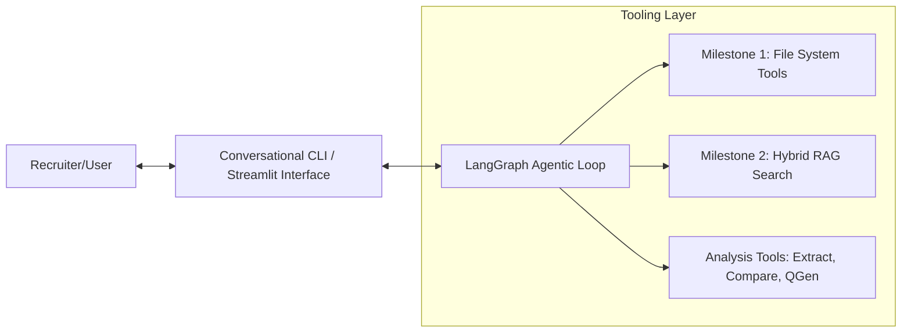
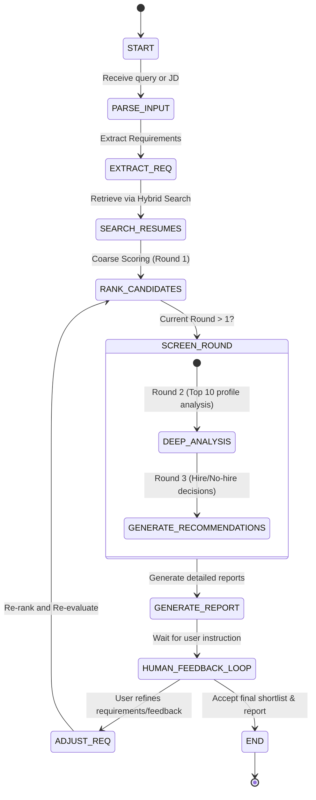

# Agentic Profile Matching Engine: Architecture Design

This document details the software architecture, LangGraph state machine workflow, tool specification, and explainability engine for the **Agentic Profile Matching Engine**. This agent serves as an intelligent recruiter assistant that parses job descriptions (JDs), searches resumes, performs multi-round screening, and handles interactive refinement.

---

## 1. System Overview & Context

The Agentic Profile Matching Engine is built on top of two prior milestones:
- **Milestone 1 (llm_file_system_assistant)**: High-performance filesystem utilities for extraction of text/metadata from `.txt`, `.pdf`, and `.docx` files.
- **Milestone 2 (rag_profile_matching)**: Hybrid semantic (ChromaDB + Sentence Transformers) and keyword (BM25 Okapi) search retrieval pipeline.

The agent coordinates these layers through an **LLM-driven state machine** using LangGraph, providing an interactive conversational interface that accepts natural language instructions and feedback to recursively refine candidates.



---

## 2. Core Agent Architecture (LangGraph)

### A. Agent State Design
The LangGraph `State` is defined as a Python dictionary (or Pydantic class) representing the shared memory of the graph execution. It tracks history, constraints, and current results:

```python
from typing import TypedDict, List, Dict, Any
from langchain_core.messages import BaseMessage

class JobRequirements(TypedDict):
    title: str
    must_have_skills: List[str]
    nice_to_have_skills: List[str]
    min_experience_years: int
    education_level: str
    other_constraints: List[str]

class CandidateMatch(TypedDict):
    candidate_id: str  # Filename/Path
    name: str
    score: int
    matched_skills: List[str]
    missing_skills: List[str]
    experience_years: int
    education: str
    relevance_excerpts: List[str]
    strengths: List[str]
    gaps: List[str]
    improvement_suggestions: str
    screening_status: str  # "Shortlisted" | "Screened" | "Borderline" | "Rejected"
    screening_reasoning: str

class AgentState(TypedDict):
    # 1. Conversation History
    messages: List[BaseMessage]
    
    # 2. Extracted/Refined Job Requirements
    requirements: JobRequirements
    
    # 3. Current Shortlist & Candidate Profiles
    shortlist: List[CandidateMatch]
    
    # 3.5. Previous Shortlist & Ranking Change Explanations
    previous_shortlist: List[CandidateMatch]
    ranking_explanation: str
    
    # 4. Screening Round Control
    current_round: int  # 1 (Coarse Filter) | 2 (Deep Screen) | 3 (Final Decision)
    
    # 5. Report Generation Output
    final_report: str
    
    # 6. Human Feedback Flag/Input
    feedback_pending: bool
    user_feedback: str
```

### B. Graph State Machine Workflow
The execution flows through specialized nodes that handle requirements parsing, retrieval, ranking, deep screening, report generation, and interaction:



### C. Graph Nodes & Logic Specification
1. **`parse_input_node`**:
   - Inspects the latest user message.
   - Detects whether the user provided a raw text Job Description (JD) or a simple conversational query (e.g. *"Give me React developers with 3+ years experience"*).
2. **`extract_requirements_node`**:
   - Calls the LLM (or `extract_requirements` tool) to parse must-have vs. nice-to-have skills, experience bounds, and target education.
   - Merges newly extracted requirements with the existing `requirements` in state (supporting additive refinements).
3. **`search_resumes_node`**:
   - Invokes the RAG Hybrid Search engine using the parsed requirements or query term.
   - Pulls candidate resume chunks, metadata, and files using Milestone 1 & 2 tools.
4. **`rank_candidates_node` (Round 1 - Coarse Filtering)**:
   - Computes initial candidate ranks by aggregating retrieval match scores (60% semantic + 40% BM25 keyword score) and applying hard constraints (e.g., must-have skills, minimum experience).
   - Populates the state's `shortlist` with the top-scoring candidates (typically top 10 from the collection).
5. **`deep_screen_node` (Round 2 - Profile Deep Analysis)**:
   - For candidates in the top-tier, this node performs deep inspection.
   - Reads full resumes (via `read_file` tool), highlights specific strengths, lists skills gaps, and writes contextual improvement suggestions for borderline candidates.
6. **`recommendation_node` (Round 3 - Hiring Decisions & Questions)**:
   - Makes final Hire / No-Hire recommendation.
   - Generates candidate-specific screening/interview questions targeting identified gaps.
7. **`generate_report_node`**:
   - Compiles the final ranked list, matching details, comparisons, and custom questions into a markdown formatted report.
8. **`human_feedback_loop_node`**:
   - Pauses the graph (using LangGraph checkpoints/interrupts) and returns control to the user.
   - Once the user submits feedback (e.g., *"Make AWS a must-have skill and re-rank"*), it routes execution back to the `adjust_requirements_node`.

---

## 3. Tooling Layer Specification

The agent interacts with the workspace through schema-defined tools. These tools bridge the agent to the underlying filesystems and index structures:

### A. Reused Filesystem Tools (Milestone 1)
- **`list_files(directory: str, extension: Optional[str])`**: Scan directories recursively to identify untracked or raw resume formats.
- **`read_file(filepath: str)`**: Direct extraction of text from `.txt`, `.docx` (Word), and `.pdf` files.
- **`search_in_file(filepath: str, keyword: str, context_size: int, limit: int)`**: Target specific keyword hits in candidate records.

### B. Reused RAG Search Tool (Milestone 2)
- **`rag_hybrid_search(query: str, limit: int, min_experience: Optional[int], must_have_skills: Optional[List[str]])`**: Runs the 60/40 semantic-lexical hybrid search against ChromaDB, applying constraints at the retrieval layer.

### C. New AI-Assisted Assessment Tools
- **`extract_requirements(jd: str) -> Dict[str, Any]`**:
  - LLM parses structured requirements from unstructured JDs.
  - *Returns*: `{"title": str, "must_have_skills": [], "nice_to_have_skills": [], "experience": int, "education": str}`.
- **`compare_candidates(candidate_ids: List[str]) -> str`**:
  - Summarizes profiles head-to-head.
  - *Returns*: A structured Markdown grid comparing Candidates on: Experience, Match Score, Match Skills, Missing Skills, and Education.
- **`generate_interview_questions(candidate_id: str) -> List[str]`**:
  - Inspects candidate profile against requirements.
  - *Returns*: 3-5 technical questions tailored to probe the candidate's gaps (e.g. *"You have extensive Python experience, but the JD requires Kubernetes. Can you explain your exposure to container orchestration?"*).

---

## 4. Multi-Round Screening Pipeline

To optimize cost and efficiency, the agent executes a cascading screening model:

| Screening Stage | Focus | Candidates Checked | Method | Cost / Latency Profile |
|---|---|---|---|---|
| **Round 1: Coarse Filtering** | Hard constraints & Retrieval Match | All (e.g., 30-100+) | Hybrid Retrieval + Filter metadata checks | Low latency / Low token cost |
| **Round 2: Deep Analysis** | Soft constraints, gaps, strengths | Top 10 | LLM deep review of complete resume text | Medium latency / High reasoning |
| **Round 3: Decision & QGen** | Hire/No-hire & tailored screening | Top 3 - 5 | LLM final validation + Tailored Question Generation | High reasoning |

```
   [ All Resumes ] 
          │
          ▼
   ┌──────────────┐
   │   Round 1    │  <-- Meta Filters & 60/40 Hybrid Search
   └──────────────┘
          │ (Filters to Top 10)
          ▼
   ┌──────────────┐
   │   Round 2    │  <-- Deep Text Evaluation (Strengths / Gaps)
   └──────────────┘
          │ (Filters to Top 3-5)
          ▼
   ┌──────────────┐
   │   Round 3    │  <-- Hire/No-Hire Recs & Customized Interview Qs
   └──────────────┘
```

---

## 5. Conversational UX & Streamlit Interface

The system implements a **Streamlit-based GUI** rather than a standard CLI or Gradio interface. Streamlit is selected for the following reasons:
1. **Rich Tabular Layouts**: Recruiting requires reviewing complex tables (like head-to-head candidate matrices) and multi-column comparison grids that are unreadable in CLI terminal output.
2. **Visual Dashboarding**: It allows splitting the screen into a *Sidebar* (displaying active job requirements, filters, and state metrics) and a *Main Panel* (containing the chat conversation and candidate reports).
3. **Sleek Chat Widgets**: Streamlit provides native `st.chat_message` and `st.chat_input` widgets that interface cleanly with the chat history.
4. **Structured Card Model Layout**: Candidate details are mapped dynamically into a structured metadata template displaying scores, experience metrics, education levels, and matched skills tags directly to support interactive workflows.

The interface maintains conversational state session-by-session, interacting with the LangGraph state machine backend.


### User Interaction Flows:
1. **Incremental Refinement**:
   - If a user inputs: *"Filter out candidates who don't know Docker"*, the agent transitions back to `adjust_requirements_node`.
   - The agent updates `requirements["must_have_skills"]` to append `"Docker"`.
   - The graph triggers re-retrieval and re-evaluation.
2. **Context-Aware Comparison Queries**:
   - Queries like *"Why did Marcus rank higher than Jane?"* are processed by retrieving both profiles from `AgentState["shortlist"]` and passing them to an explanation prompt that contrasts their relative match metrics (semantic similarity scores, skills coverage, and experience years).

---

## 6. Explainability & Reporting Engine

The agent builds detailed reporting structures to ensure transparent, auditable recruiting decisions:

### A. Candidate Match Report Template
For each shortlisted profile, the agent generates a report containing:
- **Profile Summary**: Core stats (Name, Degree, Experience Years).
- **Match Diagnostics**: Semantic score vs keyword overlap.
- **Strengths**: Proven experience blocks aligning with must-haves.
- **Gaps**: Missing skills or lack of domain exposure.
- **Improvement Suggestions**: Actionable recommendations for borderline candidates (e.g. *"Acquiring a basic certification in AWS would bridge the cloud engineering requirement gap."*).

### B. Side-by-Side Comparison Matrix
A clean markdown table comparing candidates side-by-side:

| Match Category | Candidate A (e.g., Emily Watson) | Candidate B (e.g., John Doe) |
|---|---|---|
| **Match Score** | **83** | **71** |
| **Experience** | 8 Years (Stanford M.S.) | 5 Years (Georgia Tech M.S.) |
| **Core Strengths** | Container Orchestration (K8s/Docker), FastAPI | Web API development, PostgreSQL |
| **Missing Core Skills**| None | Kubernetes |
| **Decision Status** | **Strong Hire** | **Borderline Hire** |

---

## 7. Standalone Architecture & Free Model APIs

### A. Standalone Codebase & Replication Strategy
To make the Agentic Profile Matching Engine completely independent and production-grade, the files and functionalities from Milestone 1 and Milestone 2 have been structured under the `src/agentic_profile_matching/` packaged namespace:
- **`fs_tools.py`** (Milestone 1): Filesystem reader for text, DOCX, and PDF formats.
- **`config.py`, `resume_rag.py`, `job_matcher.py`, `generate_dataset.py`** (Milestone 2): Ingestion, RAG chunking, ChromaDB vector storage, BM25 indexing, and hybrid matching.
- **Clean Absolute Imports**: All modules import each other using standard absolute package-level imports (e.g. `from agentic_profile_matching import config`).
- **No Path Dependencies**: This eliminates cross-project `sys.path` modifications, ensuring this codebase runs fully standalone and does not break or affect the original Milestone 1 & 2 directories.


### B. Free-Tier API & Open-Source LLM Stack
The system operates on 100% free or open-source tiers to guarantee zero runtime costs:
1. **Embeddings & Vector Database**: Local `sentence-transformers/all-MiniLM-L6-v2` embeddings and local, self-hosted `ChromaDB` storage.
2. **LLM Orchestration Layer**: The LangGraph workflow is designed to connect to the following free developer API options:
   - **Groq API** (Free Tier): Utilizing fast models like `llama-3.3-70b-versatile` or `mixtral-8x7b-32768`.
   - **Google Gemini API** (Free Developer Plan / Gemini Pro): Offering large context windows and strong reasoning for candidate comparison and screening report generation.
3. **Execution Safety**: API keys are loaded locally from environment variables (`GROQ_API_KEY`, `GEMINI_API_KEY`) via a `.env` file, ensuring private and secure operation.

### C. Rate Limit & Token Usage Management
To proactively prevent 429 rate limit exceptions and TPM/RPM exhaustion on free API tiers, the engine implements five layers of safeguards:
1. **Tiered Cascading Pipeline**: 
   - **Round 1 (Coarse Filtering)** is executed 100% locally using Sentence Transformers and BM25 indexing (costing 0 API requests and 0 LLM tokens). This narrows the search space from 100+ resumes down to the Top 10.
   - **Round 2 & 3 (Deep Analysis & Recommendations)** are only executed on the narrowed candidates (Top 10 and Top 5 respectively).
2. **Sequential Requests Throttling**: A delay (`config.THROTTLE_DELAY = 1.5` seconds) is enforced between sequential LLM screening calls to space out queries and stay under RPM limits.
3. **Token Input Truncation**: Resume texts are truncated to a safe maximum length of 12,000 characters (approx. 3,000 tokens) before prompt generation to prevent TPM spikes.
4. **Compact Structured Outputs**: Node prompts enforce concise JSON structures, keeping output tokens under ~200 per call.
5. **Exponential Backoff Retry**: Every LLM function is wrapped in `execute_with_retry`, which catches 429 errors and retries with doubling delays (up to 5 attempts).

---

## 8. Project Roadmap & Milestones

The details regarding current implementation progress, release status of phases 1-5, and the long-term backlog of features are tracked in the root [ROADMAP.md](../ROADMAP.md).

---
