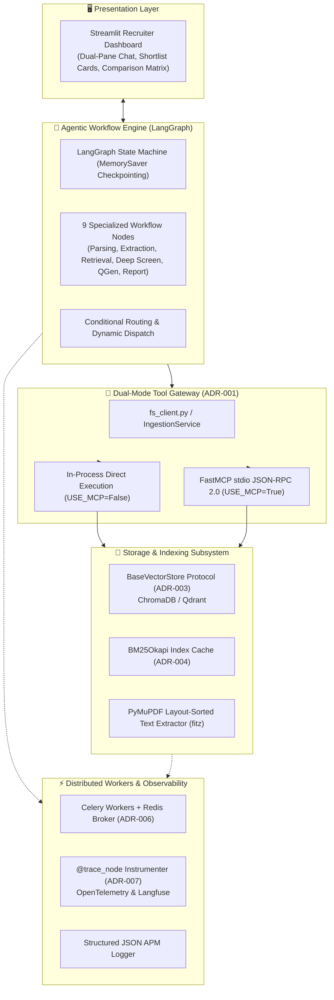
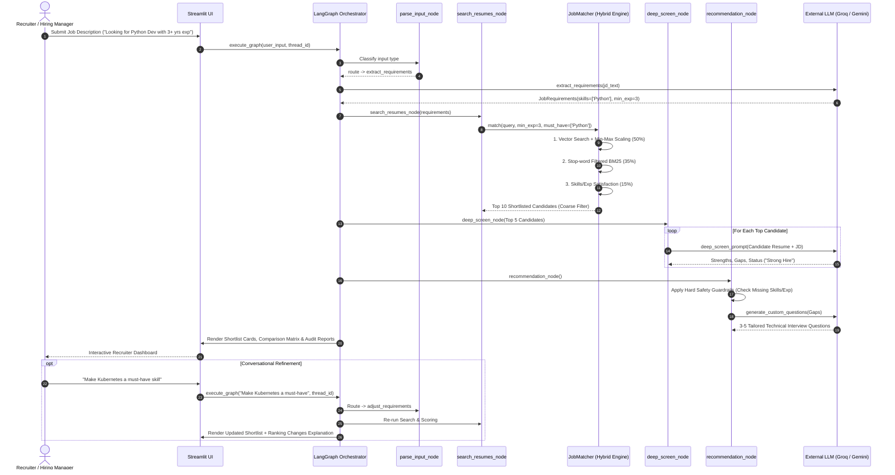
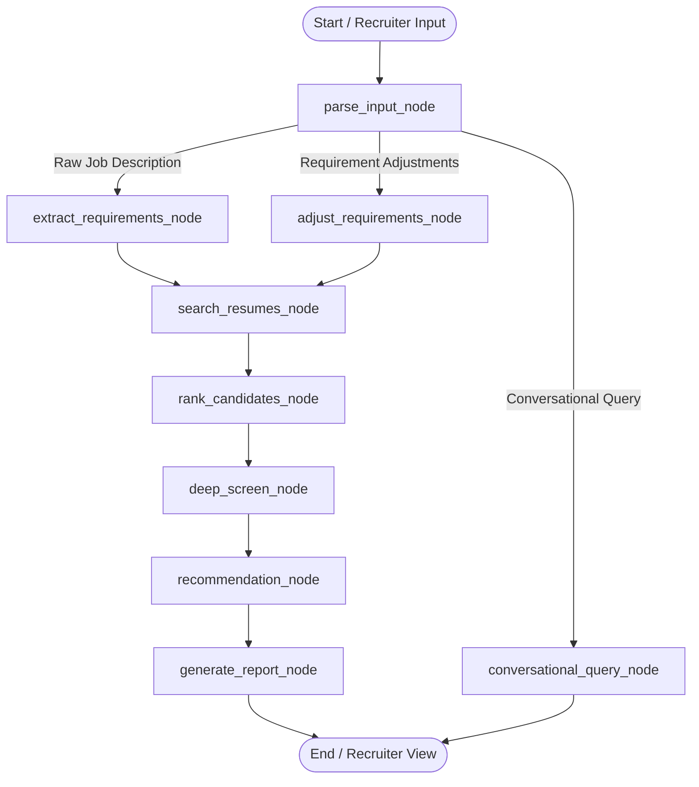
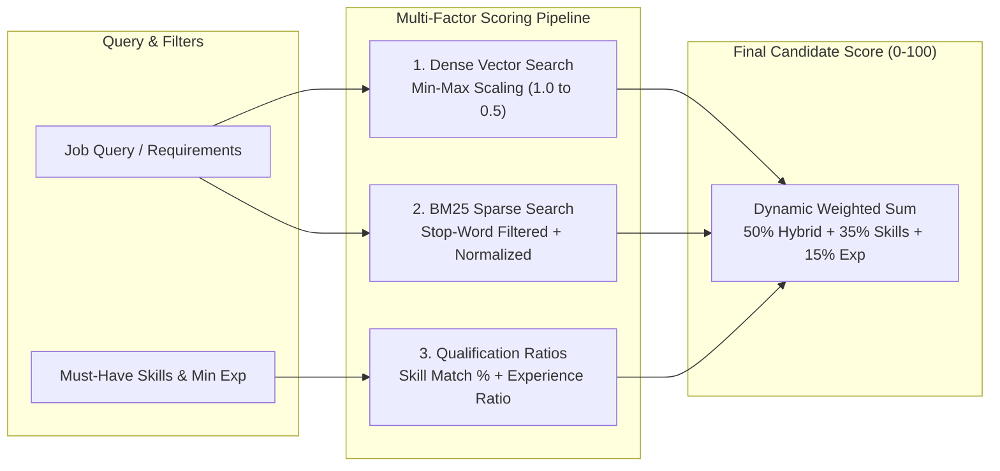
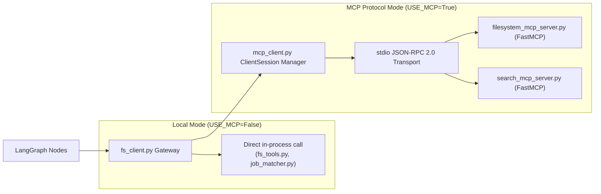
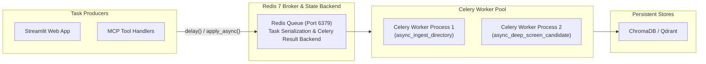

# Agentic Profile Matching Engine: Technical Architecture

This document provides the comprehensive technical architecture, dataflow sequence diagrams, mathematical scoring formulations, state machine specifications, and system designs for the **Agentic Profile Matching Engine**.

---

## 1. System Overview & Architectural Topology

The Agentic Profile Matching Engine coordinates document parsing, vector indexing, sparse keyword retrieval, multi-round LLM screening, and real-time conversational refinement.



### Core Architectural Principles
1. **Separation of Concerns (SoC)**: Presentation logic (Streamlit), agent orchestration (LangGraph), business services (`IngestionService`), and transport protocols (FastMCP) remain completely decoupled.
2. **Protocol-Driven Abstraction**: Vector store operations conform to the `BaseVectorStore` structural protocol (`typing.Protocol`), enabling zero-code changes when switching between ChromaDB, Qdrant, or cloud vector stores.
3. **Idempotency by Design**: Ingestion keys are deterministically generated from document names and section indices (`{file}_chunk_{idx}`), guaranteeing safe, duplicate-free re-indexing.
4. **Cascading Cost & Latency Optimization**: Dense embedding and BM25 scoring narrow large candidate pools down to top contenders locally ($0$ LLM cost), running compute-intensive LLM deep audits strictly on the top-ranked candidates ($O(N) \to O(K)$).

---

## 2. End-to-End Execution Sequence

The sequence diagram below traces the end-to-end execution lifecycle from initial job description input through coarse ranking, LLM deep screening, hiring recommendation, and conversational constraint refinement:



---

## 3. LangGraph Agent Workflow & State Machine

### A. Graph State Design (`AgentState`)
The agent state schema (`agent/state.py`) is defined as a Python `TypedDict`, avoiding serialization overhead during checkpoint transitions while enforcing strict Pydantic V2 schemas at LLM boundaries:

```python
from typing import TypedDict, List, Optional
from langchain_core.messages import BaseMessage

class JobRequirements(TypedDict, total=False):
    title: str
    must_have_skills: List[str]
    nice_to_have_skills: List[str]
    min_experience_years: int
    education_level: str
    other_constraints: List[str]

class CandidateMatch(TypedDict, total=False):
    candidate_id: str
    name: str
    score: int
    matched_skills: List[str]
    missing_skills: List[str]
    experience_years: int
    education: str
    relevance_excerpts: List[str]
    strengths: List[str]
    gaps: List[str]
    improvement_suggestions: str
    screening_status: str
    screening_reasoning: str
    interview_questions: List[str]

class AgentState(TypedDict, total=False):
    messages: List[BaseMessage]
    requirements: JobRequirements
    shortlist: List[CandidateMatch]
    previous_shortlist: List[CandidateMatch]
    ranking_explanation: str
    coarse_screen_limit: Optional[int]
    deep_screen_limit: Optional[int]
    recommendation_limit: Optional[int]
    current_round: int
    final_report: str
    feedback_pending: bool
    user_feedback: str
    errors: List[str]
```

### B. State Graph Topology & Routing
The workflow is implemented as a 9-node `StateGraph` compiled with `MemorySaver` in-memory checkpointing for persistent session tracking via `thread_id`:



### C. Node Responsibilities & Specifications

| Node | Purpose | Inputs | Outputs | Error Boundary / Fallback |
|:---|:---|:---|:---|:---|
| **`parse_input_node`** | Classifies incoming text as raw JD, constraint adjustment, or conversational query | `messages[-1]` | Routing decision | Defaults to `raw_jd` on ambiguous input |
| **`extract_requirements_node`** | Extracts structured requirements from raw JDs via LLM | Raw JD string | `JobRequirements` | Pydantic validation fallback |
| **`adjust_requirements_node`** | Updates active requirements based on recruiter comments/slider changes | Active requirements + comment | Modified `JobRequirements` | Retains previous requirements on failure |
| **`conversational_query_node`** | Answers free-form recruiter questions via ReAct loop with MCP tools | User question + context | Response message | Direct context answering without tools |
| **`search_resumes_node`** | Queries ChromaDB and BM25 index via `JobMatcher` | `JobRequirements` | Raw candidate matches | Returns empty list if no matches found |
| **`rank_candidates_node` (Round 1)** | Applies multi-factor hybrid scoring and slices top $N$ candidates | Candidate matches | Shortlist (Top 10) | Preserves existing sort order |
| **`deep_screen_node` (Round 2)** | Sequential LLM audit extracting strengths, gaps, and status | Shortlist (Top 5) | Enriched `CandidateMatch` | Default strengths/gaps on LLM failure |
| **`recommendation_node` (Round 3)** | Applies safety guardrails and synthesizes interview questions | Enriched Shortlist | Final status + questions | Status override on skill/exp deficits |
| **`generate_report_node`** | Compiles markdown comparison matrix and chat response | Full Shortlist | `final_report` markdown | Generates fallback text summary |

---

## 4. Hybrid Search & Multi-Factor Scoring Engine

Candidate matching in `job_matcher.py` combines dense semantic search (ChromaDB), sparse lexical search (BM25 Okapi), and hard qualification constraints into a deterministic **0–100 Match Score**.



### A. Algorithmic Breakdown

1. **Min-Max Normalized Vector Similarity**:
   - *Problem*: Raw cosine distance in embedding spaces clusters tightly (e.g. `0.35`–`0.55`), causing top candidates to receive artificially deflated scores.
   - *Engineering Solution*: Map the closest vector in the retrieved batch to `1.0` (100% similarity) and scale linearly down to `0.50` for the furthest vector:
     ```python
     # Scales nearest match to 1.0 and furthest to 0.50
     norm_sim = 1.0 - 0.5 * ((dist - min_dist) / max(1e-5, max_dist - min_dist))
     semantic_score = max(0.0, min(1.0, norm_sim))
     ```

2. **Stop-Word Filtered BM25 Keyword Search**:
   - *Problem*: High-frequency recruiting noise tokens (`"looking"`, `"for"`, `"years"`, `"experience"`) distort BM25 term frequency calculations.
   - *Engineering Solution*: Filter queries against a curated stop-word set before querying the cached in-memory `BM25Okapi` sparse matrix:
     ```python
     stop_words = {"the", "and", "for", "with", "looking", "years", "exp", ...}
     tokens = [w for w in re.findall(r"\b\w+\b", query.lower()) if len(w) > 1 and w not in stop_words]
     bm25_score = bm25_index.get_scores(tokens)[chunk_idx] / max_bm25_score
     ```

3. **Dynamic Weight Allocation**:
   The engine automatically adapts component weights based on whether explicit must-have skills or experience bounds are supplied:

   | Scenario | Raw Hybrid (60% Dense + 40% Sparse) | Skill Match Ratio | Experience Satisfaction |
   |:---|:---:|:---:|:---:|
   | **With Must-Have Skills** | **50%** | **35%** | **15%** |
   | **General Semantic Search (No Must-Haves)** | **85%** | **0%** | **15%** |
   | **Zero Constraints Specified** | **100%** | **0%** | **0%** |

---

## 5. Tooling Layer & Model Context Protocol (MCP)

The engine implements a **Dual-Mode Gateway Architecture** (ADR-001) toggled dynamically via `config.USE_MCP`:



### Exposed Protocol Tools & Resources
- **Filesystem Server (`filesystem_mcp_server.py`)**:
  - Tools: `list_files`, `read_file`, `search_in_file`.
  - Resources: `resumes://all`, `resumes://{filename}`.
  - Background Watcher: `FileSystemWatcher` triggers auto-ingestion on directory file modifications.
- **Search Server (`search_mcp_server.py`)**:
  - Tools: `search_web` (Tavily API search with fallback mock profiles), `search_candidates` (ChromaDB vector lookup), `fetch_candidate_notes` (Internal HR screening file fetcher).

---

## 6. Distributed Task Queue (Celery + Redis)

For production deployments handling bulk document parsing and parallel LLM audits, the engine provides an asynchronous task processing layer via **Celery** and **Redis** (ADR-006):



- **`async_ingest_directory`**: Background document chunking, PyMuPDF extraction, and idempotent vector upserting.
- **`async_deep_screen_candidate`**: Parallel LLM candidate audits with rate-limited task batching.
- **Docker Compose Topology**: Multi-container setup orchestrating `app` (Streamlit port 8501), `redis` (port 6379), and `celery_worker`.

---

## 7. Production Observability & Evaluation

### A. Structured JSON Logging & Node Tracing
Every workflow execution is instrumented via structured JSON logging and the `@trace_node` decorator:

```json
{
  "timestamp": "2026-08-14 17:00:12,345",
  "level": "INFO",
  "logger": "agentic_profile_matching.node.rank_candidates",
  "message": "Completed node execution: rank_candidates in 1.24ms",
  "event": "node_end",
  "node": "rank_candidates",
  "elapsed_ms": 1.24,
  "thread_id": "session-4247cca1"
}
```

### B. Pluggable Observability Backends
- **Langfuse (`OBSERVABILITY_BACKEND=langfuse`)**: Captures complete execution traces, token usage, LLM input/output payloads, and latency waterfalls.
- **OpenTelemetry (`OBSERVABILITY_BACKEND=opentelemetry`)**: Emits standard OTLP spans for enterprise APM platforms (Datadog, Dynatrace, AWS CloudWatch).

### C. RAG Evaluation Benchmark Suite
Automated evaluation pipelines (`tests/eval/`) run against ground-truth scenarios (`data/eval_scenarios.json`) measuring:
1. **Retrieval Recall@K**: Proportion of ground-truth relevant profiles retrieved in the top $K$ candidates.
2. **Mean Reciprocal Rank (MRR)**: Precision of the top-ranked ground-truth profile position.
3. **Response Faithfulness**: Verification that LLM screening summaries strictly reflect extracted candidate resume text with zero hallucinated skills or experiences.

---

## 8. AI Safety, Guardrails & Production Resilience

1. **Grounded Recommendation Hierarchy**: Preserves qualitative LLM deep screening status assignments (`"Strong Hire"`, `"Borderline Hire"`, `"Rejected / No-Hire"`) while enforcing deterministic overrides if mandatory qualifications are unmet.
2. **Fact-Grounded Prompt Engineering**: Passes explicit candidate ground-truth metrics (`Experience Years`, `Matched Skills`, `Missing Skills`) into all report explanation prompts, forbidding ungrounded claims.
3. **Exponential Backoff & Rate Limit Handling**: All LLM invocations are wrapped in `execute_with_retry` catching HTTP 429 exceptions with exponential backoff (up to 5 retries).
4. **Token Truncation Budgeting**: Candidate resume inputs are capped at 12,000 characters (~3,000 tokens) with concise structured JSON output constraints, eliminating TPM/RPM exhaustion.
5. **Ingestion Idempotency**: Deterministic chunk IDs (`{filename}_chunk_{idx}`) prevent vector store bloat across repeated ingestion runs.
