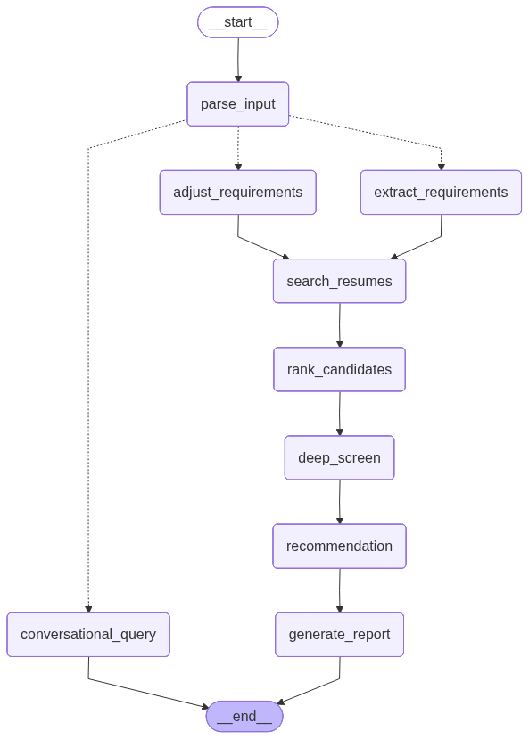

# 🔄 LangGraph Agent State Machine Specification

This document details the state machine topology, node transitions, checkpointing boundaries, and state schema for the **Yojaka AI** agent workflow.

> 🌐 **Interactive Documentation**: Available on the [**Yojaka AI Documentation Site**](https://shashankch.github.io/yojaka-ai-profile-matching-engine/state_machine/).

---

## 🗺️ State Machine Topology

The agent workflow is structured as a 9-node `StateGraph` compiled with in-memory `MemorySaver` checkpointing keyed by `thread_id`:

<p align="center">
  
</p>

---

## 📋 State Graph Nodes & Transitions

### 1. Ingress & Routing
- **`__start__` $\to$ `parse_input`**: Ingress message normalization, timestamp initialization, and clean session field setup.
- **`parse_input` $\to$ Conditional Edge (Intent Router)**:
  - **`extract_requirements`**: Triggered when a new job description is pasted or requirements are absent.
  - **`adjust_requirements`**: Triggered on slider adjustments, salary constraints, or recruiter feedback ("make Kubernetes a must-have").
  - **`conversational_query`**: Triggered on general candidate comparison, talent pool Q&A, or live external web search without running candidate screening.

### 2. Retrieval & Screening Cascade
- **`extract_requirements` / `adjust_requirements` $\to$ `search_resumes`**: Queries `CompositeVectorStore` and cached in-memory `BM25Okapi` index using `JobMatcher`.
- **`search_resumes` $\to$ `rank_candidates`**: Applies multi-factor hybrid scoring (dense cosine 50% + BM25 35% + qualification satisfaction 15%) and slices the coarse Top 10 shortlist.
- **`rank_candidates` $\to$ `deep_screen`**: Executes parallel LLM audits (concurrency bounded by `Semaphore(max_concurrent=2)`) over the top 5 candidates.
- **`deep_screen` $\to$ `recommendation`**: Applies deterministic safety guardrails (missing must-have skill / experience deficit overrides) and generates 3–5 tailored technical interview questions.
- **`recommendation` $\to$ `generate_report`**: Compiles side-by-side comparison matrix and candidate evaluation summaries.
- **`generate_report` $\to$ `__end__`**: Persists final report in checkpoint state and returns to recruiter UI.
- **`conversational_query` $\to$ `__end__`**: Returns conversational answer or web search synthesis without modifying active candidate shortlist.

---

## 🗃️ State Schema (`AgentState`)

```python
from typing import TypedDict, List, Optional
from langchain_core.messages import BaseMessage

class JobRequirements(TypedDict, total=False):
    title: str
    must_have_skills: List[str]
    nice_to_have_skills: List[str]
    min_experience_years: int
    education_level: str
    other_constraints: List[str]
    skill_expansions: dict[str, List[str]]

class CandidateMatch(TypedDict, total=False):
    candidate_id: str
    name: str
    score: int
    matched_skills: List[str]
    missing_skills: List[str]
    experience_years: int
    education: str
    relevance_excerpts: List[str]
    strengths: List[str]
    gaps: List[str]
    improvement_suggestions: str
    screening_status: str
    screening_reasoning: str
    interview_questions: List[str]

class AgentState(TypedDict, total=False):
    messages: List[BaseMessage]
    requirements: JobRequirements
    shortlist: List[CandidateMatch]
    previous_shortlist: List[CandidateMatch]
    ranking_explanation: str
    coarse_screen_limit: Optional[int]
    deep_screen_limit: Optional[int]
    recommendation_limit: Optional[int]
    current_round: int
    final_report: str
    feedback_pending: bool
    user_feedback: str
    errors: List[str]
```

---

## 🛡️ Invariant Guarantees (ADR-011, ADR-012)

1. **Stateless Credential Isolation (CWE-312)**: `AgentState` strictly isolates domain metadata. API keys and secrets are never serialized into checkpoints.
2. **Functional Copy-on-Write Immutability**: All node transitions construct fresh dictionary instances (`{**c, ...}`) preventing mutation side-effects and ensuring checkpoint replay safety.
